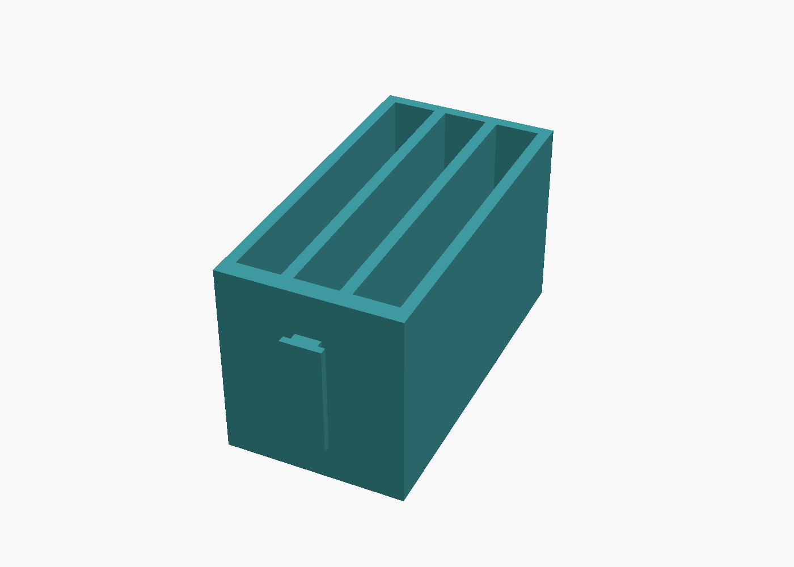
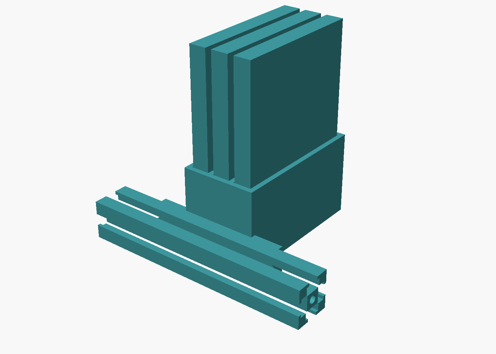

# 3-Bay Vertical 2.5" SSD Holder (T-Slot Mount)

Parametric OpenSCAD design for a bracket that holds three 2.5" drives
(70 x 100 x 9 mm) upright, side by side along a 20x20mm T-slot aluminum
extrusion.



## Design

- **Drives side by side along the rail** — all three bays sit the same
  distance out from the rail, spread along its length, rather than
  receding front-to-back. No drive hangs off the end of a long lever arm.
- **Fully enclosed bays, open top only** — each drive drops into a boxed-in
  tub: floor + left/right dividers + front/back walls, all 40mm tall. Only
  the top (where the SATA/power connectors are, on a 100mm-tall drive) is
  open, for cable routing.
- **One plate, one key** — a single flat plate carrying a single T-shaped
  key running its full 70mm length. The key slides into the rail's channel
  from the end of the extrusion and is trapped by that channel's back wall
  and both side lips; the plate bears flat against the rail face. Tapered
  lead-ins at both ends let it start from either direction and back
  straight off the way it went on.
- **Lean** — the mount projects only 6.2mm from the comb (plate + key),
  versus 23.6mm for the previous wrap-around cradle, and uses roughly a
  third of the material.


*Cross-section: the plate with its single T-key, joined to the comb floor.*

## About "the longer side"

With the drives side by side, the comb's mounting face is its **39.2mm**
one. The 70mm faces are the two *ends* of the stack — mounting there is
exactly what puts the drives back in a front-to-back line.

So rather than move the mount, the plate is **extended to 70mm along the
rail**, overhanging the comb by ~15mm at each end. That's the longest rail
engagement available while keeping the drives side by side. If the
overhang is in the way, set `plate_len = comb_width` for a flush 39.2mm
plate.

## Set screws

Two optional M3 set screws (`set_screw = true`) run through the plate's
overhanging ends, where nothing is behind them so a driver reaches with the
drives still installed. Driving them against the rail face pushes the
bracket out and pulls the key's head up against the slot lips, taking the
play out of the slide fit.

They're worth using. A single sliding key with clearance on all sides will
rock a little under three loaded drives — the key alone stops the bracket
coming off the rail, but it doesn't clamp it. The screws sit low on the
plate, below the key, so they also lean against the direction a loaded
holder wants to tip. Set `set_screw = false` to omit them.

## Fitting your rail

Defaults match common 20-series T-slot/V-slot extrusion:

| Parameter | Default | What it is |
|---|---|---|
| `rail_size` | 20 | Extrusion cross-section (square) |
| `slot_mouth` | 6.2 | Width of the narrow opening on the rail face |
| `channel_w` | 9.4 | Internal width of the T-slot channel |
| `lip_thickness` | 1.6 | Depth of the mouth before it opens into the channel |
| `head_depth` | 1.6 | How far the key's wide part sits inside the channel |
| `key_clearance` | 0.3 | Per-side slack so the key slides freely |
| `key_lead_in` | 2.5 | Taper at each end of the key |

**Measure your actual rail** before printing the whole thing — a wrong fit
either won't slide in or will be loose. Test on a scrap of rail first if
you can: too tight, bump `key_clearance` up in 0.1-0.2mm steps; sloppy,
reduce it. `lip_thickness` + `head_depth` (the key's insertion depth,
3.2mm total) must stay shallower than the rail's actual channel depth or it
won't seat.

Footprint: **70 x 79.4 x 43 mm** (along rail x out from rail x height).

## Verifying the fit

`fit_check.scad` drops the holder into a modeled 20x20 rail and three
modeled drives, then intersects them. Any real interference shows up as
intersection volume:

```
openscad -o clash.stl -D 'show="rail_clash"'  fit_check.scad && admesh clash.stl
openscad -o clash.stl -D 'show="drive_clash"' fit_check.scad && admesh clash.stl
openscad -o asm.png --render -D 'show="assembly"' fit_check.scad
```



Current results:

| Check | Volume | Reading |
|---|---|---|
| `rail_clash` | 0.0017 mm³ | Coincident-surface noise, not interference — the key clears the slot lips with its 0.3mm per-side clearance intact |
| `drive_clash` | 0.0000 mm³ | Zero-thickness contact at z=3 only — the drives resting on the bay floor |

Engagement was checked too: the key's 8.8mm head sits inside a 9.4mm
channel behind a 6.2mm mouth, so 1.3mm of lip catches it on each side.

The modeled rail is a *nominal* 20-series profile. It confirms the geometry
is self-consistent; it is not a substitute for measuring your own rail.

## Files

- `ssd_holder.scad` — parametric source; all variables are at the top.
  Assign `render_holder = false` after including it to use as a library.
- `ssd_holder.stl` — ready-to-slice mesh, verified manifold (1 part, 0
  defects via `admesh`)
- `fit_check.scad` — interference and assembly check (above)

## Print settings

- 3-4 perimeter walls, 20%+ infill
- PETG or ABS recommended (drives run warm); PLA is fine for a desk build
- **No supports needed** — the comb floor and the mounting plate both sit
  flat on the bed, and the key's 3.2mm horizontal protrusion is short
  enough to print clean
- Print the plate and key with clean, well-adhered first layers — that's
  the load-bearing interface with the rail

## Regenerating the STL

```
openscad -o ssd_holder.stl ssd_holder.scad
```
